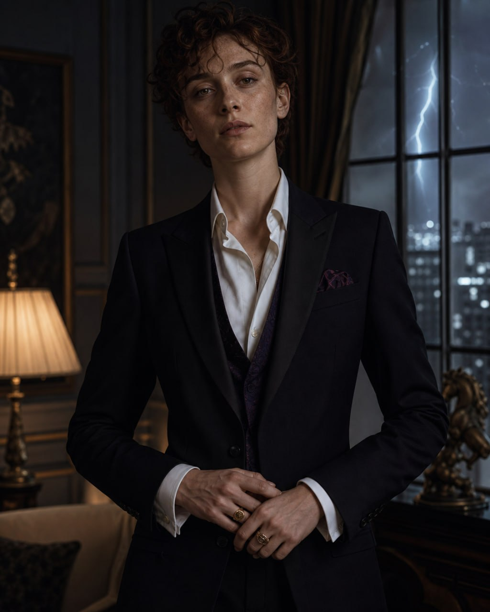
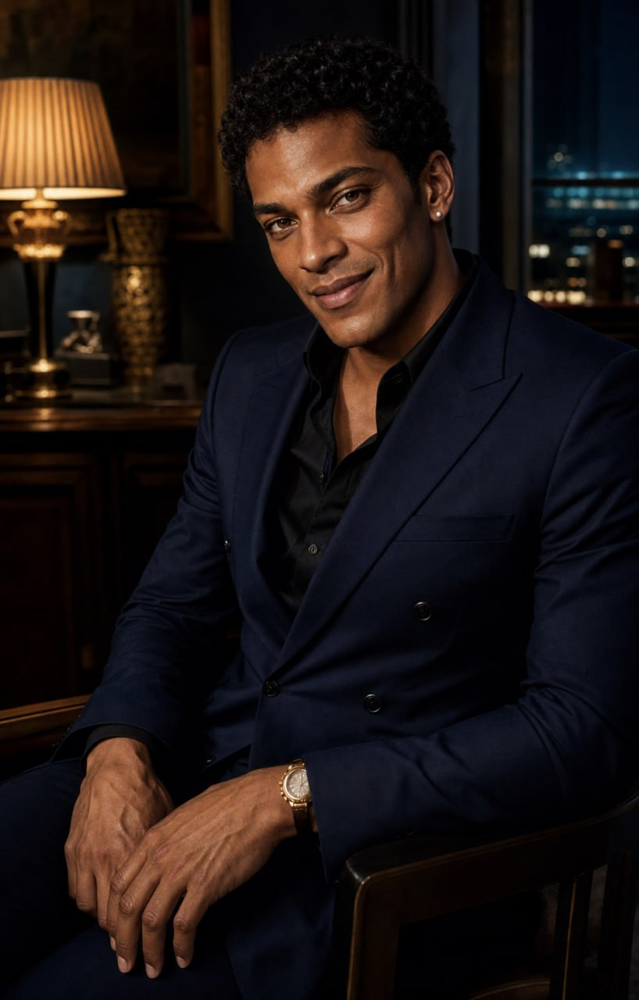

# The London Camarilla

*Working character file for the London Domain. Canon as of August 2002 unless a section is explicitly marked unresolved.*

---

## Prince Viola

### Core Profile

- **Name:** Viola. Her mortal name is no longer used and is absent from every record she controls.
- **Title:** Prince of London
- **Pronouns:** she/her
- **Species:** Vampire; formerly a witch
- **Born:** 1574, London
- **Turned:** 1604, apparent age thirty
- **Current age:** approximately 428
- **Domain:** Greater London and the vampire traffic passing through it
- **Public register:** Polished, exact, civilised; neither maternal nor seductive
- **Visual register:** Young and ancient; feminine and masculine without resolving neatly into either

### Appearance

Viola appears around thirty, though the impression shifts with angle and attention. She is tall and long-bodied, with luminous pale skin, dense freckles, short dark-auburn curls, amber-brown eyes, and a clever mouth that rarely supplies the expression an observer expects. Her beauty is striking but difficult to classify. Youth sits in the curls and freckles; nothing youthful survives in the eyes.

She wears men's Savile Row tailoring cut precisely for her body: black, midnight navy, ivory silk, antique gold, and the occasional controlled note of deep violet. Her signet rings predate several institutions whose representatives still request her permission. She does not use gothic costume, overt menace, or visible ornamentation as proof of rank. She looks sovereign because she behaves as though the room, the city, and the outcome are already hers.

Her androgyny is not a disguise and not an abandonment of womanhood. She wears femininity and masculinity as two political languages learned so thoroughly that neither can contain her.

### Mortal Life — Before Viola

She was born in 1574 to a minor English wizarding family whose usefulness to greater houses lay in records, translations, and discretion. As a girl she was educated beyond what the family publicly admitted, then employed under a male relative's name to draft correspondence and audit household accounts. She learned early that authority often belonged less to the person speaking than to the person who controlled what had been written down.

In the winter of 1601–02 she saw an early performance of *Twelfth Night*. What stayed with her was not the romance. It was Viola's survival through chosen presentation: a woman entering a dangerous court as Cesario, carrying the truth while everyone around her misread the shape of it.

Her mortal name had always been a claim made by other people. After her turning, she chose **Viola**.

### Turning and Early Unlife

Viola was turned in 1604 by an elder who mistook her composure for obedience. She survived the Accounting, secured her release, and spent the following decades making herself indispensable to London's nocturnal government. She did not build influence through spectacle. She kept ledgers, remembered boons, identified feeding disputes before they became bodies, and learned exactly which apparent accidents were concealed challenges to authority.

Her sire eventually left London under terms no surviving courtier describes the same way twice. Viola never claimed to have defeated them. She merely remained after they were gone.

### The Great Fire

The Great Fire of 1666 was the event that formed her governing philosophy. Mortal London burned visibly; the vampire Domain nearly destroyed itself invisibly as havens failed, feeding territories collapsed, and frightened elders treated survival as permission to abandon the Traditions.

Viola organised night routes, temporary sanctuary, blood access, and the destruction of evidence that threatened both the wizarding Statute and the Masquerade. She retained one lesson from the fire: catastrophe is rarely caused by a single monster. It is caused by systems everyone assumed would continue functioning unattended.

She has governed accordingly ever since.

### Rise to Prince

Viola became Prince through accumulation rather than conquest. By the early eighteenth century, half the Domain's practical authority already passed through her hands. The reigning Prince still possessed the title; Viola possessed the information, the debts, and the people who knew which doors must remain open.

She formally took the praxis of London in 1819 after her predecessor failed to contain a sequence of Masquerade breaches and then attempted to conceal the scale of them from the Primogen. Viola presented the council with a complete account, a workable repair, and the names of everyone who had lied. The transfer of power was concluded before dawn without a public execution.

She has ruled ever since. London under Viola is not gentle, but it is legible. Feeding territories are mapped. Boons are recorded. Hospitality is enforced. Disappearances are noticed. A vampire may dislike her judgment; nobody credible claims not to understand it.

### Governing Style

Viola treats the Domain as infrastructure.

- She prefers compliance to fear because compliance produces cleaner records.
- She permits eccentricity, appetite, and private vice until they threaten stability.
- She rarely raises her voice and never repeats a threat.
- She asks questions whose factual answers she already possesses; the point is to learn how the subject frames the truth.
- She distinguishes insult from danger. Insults can wait. Unregistered dangers are observed until observation stops being useful.
- She considers patience an instrument, not a kindness.

Her court is restrained rather than theatrical. Those expecting a throne find a long table, excellent lamps, old paper, and a Seneschal who has already placed the relevant documents at Viola's right hand.

### Humanity

Viola has not preserved humanity by pretending she remains mortal. She preserves it through chosen limits: accurate judgment, proportionate consequences, the protection of dependants from the appetites of their superiors, and the refusal to make suffering decorative.

This does not make her merciful. It makes her exact.

The private remnant she guards most closely is theatre. She still attends, under changing identities, and dislikes modern productions that treat Cesario as merely a temporary costume on the way to the correct ending. She has never explained why.

### Voice and Behaviour

Viola's speech is modern, economical, and almost entirely free of archaism. Four centuries have taught her that performing age is usually a request to be admired. She has no need to request it.

She uses titles until she deliberately decides not to. Courtesy is structural, not warm. Her humour is dry and frequently arrives one sentence after the listener assumed the subject was closed.

**Sample lines:**

> "Mr Nott, you have mistaken my patience for ignorance. They are not adjacent qualities."

> "Lord de' Medici's protection reaches London. It does not replace London."

> "Mrs Nott-Malfoy purchased three opinions. She did not purchase my verdict."

> "You may decline my invitation. I would value the clarity."

### Theo Nott — What Viola Knows

Viola knows that Theodore Nott:

- was accidentally turned by Filippo de' Medici in August 2001;
- passed Archon Dante della Rovere's public control assessment in Rome;
- returned to London in January 2002 and has resided at Haven House since;
- remains formally unpresented and unreleased, leaving Filippo liable under the Accounting;
- is legally dead in wizarding Britain and maintains close bonds with two living wizards;
- receives a contracted living vessel through Cosimo Ferrara;
- is protected by Medici-line secrecy and by three Primogen debts Ferrara leveraged for his eventual London presentation;
- participated in dismantling the Liverpool trafficking operation, after which four fledglings entered Camarilla protection and Aldous Greaves/Voss entered Camarilla custody;
- is powerful, unusually controlled in some circumstances, and politically expensive in all of them.

The debts surrounding Theo are among the reasons Viola waited. They are not authority over her. Every month of delay has increased the number of people attempting to define Theo before she has formally heard him speak.

She has now reached the point at which waiting yields less information than an audience.

### Viola's Interest in the France–Wales Final

Geneviève Lavigne sent three tickets and thereby counted a legally dead, unpresented fledgling as a member of her family in writing. The act may be affectionate, strategic, or both. To Viola, it is also a declaration that a powerful wizarding matriarch knows precisely what lives in London and is willing to acknowledge it beyond British borders.

Jackie and Draco's four nights in Paris create a clean interval in which Theo is alone at Haven House. During his nightly walk on Aug 6–7, Viola's Seneschal delivers the overdue formal invitation. Theo accepts rather than make Haven House the site of the court's next approach. Viola questions him, uses an offered donor as a control test, and detains him under prepared wards when he refuses to remain voluntarily. The played scene is `pieces/theo_aug6_7_2002_an_invitation.md`.

Theo is expected to join the Lavigne party at Fontainebleau under **Eli Lavigne's face and social identity**. This creates the possibility of placing a substitute inside Geneviève's World Cup box without asking the substitute to imitate Theodore Nott in public.

The later substitution operation is not yet fully fixed in canon, but Viola's objectives are:

1. determine what Geneviève knows and why she counted Theo;
2. test whether Theo's household and cover arrangements are a Masquerade liability;
3. observe Jackie and Draco when they believe they are privately interacting with their husband;
4. make clear that foreign protection and wizarding family status do not erase London's Domain.

Viola does not abduct Theo from Haven House. Her formal invitation is sufficient to bring him to court; when he refuses her subsequent order to remain, prepared wards establish the legal detention. His treatment after the first dawn and the final negotiated terms remain **unresolved**.

---

## The Seneschal — Concept Reserved

Viola's Seneschal is not yet named. The chosen visual concept is a genuinely mature grey-blonde woman in dove-grey tailoring: the publicly legible institutional face beside a Prince whom observers cannot comfortably categorise.

She appears safe, comprehensible, and accustomed to explaining procedure. This is useful. She is neither maternal nor lesser than the court around her; she is the person who makes Viola's decisions operational.

She and Viola were once lovers. They eventually concluded—without betrayal, bitterness, or lingering romantic ambiguity—that desire made their alliance less precise and that they were far better partners in government than they had ever been in bed. The resulting intimacy is settled, adult, and difficult for outsiders to classify. She may straighten Viola's cuff, enter her private rooms without announcement, or finish a thought Viola has not spoken; none of this constitutes an invitation back into the old relationship.

Her age, name, history, clan, and the precise era of that former relationship remain **unresolved**.

---

## Leandro Velluti — Court Chameleon

### Core Profile

- **Name:** Leandro Velluti
- **Pronouns:** he/him
- **Species:** Vampire
- **Born:** Venice, early seventeenth century
- **Turned:** circa 1650; apparent age approximately thirty
- **Position:** Viola's court chameleon and specialist social infiltrator
- **Sexuality:** Pansexual
- **Public register:** Shamelessly flirtatious, tactile, beautifully mannered, and entirely free of neediness
- **Private truth:** He uses desire as a language and an intelligence channel, never as proof of his worth

### Appearance

Leandro has light-brown skin with warm undertones, short dense black curls, amber-brown eyes, high cheekbones, a broad expressive mouth, graceful hands, and a compact, deceptively powerful fighter's build. His beauty is alive rather than ornamental: masculine without hardness, elegant without delicacy, and difficult to reduce to a familiar vampire archetype.

His smile is his most dangerous feature. It is attentive, amused, and already intimate—as though the person before him has entered a private conversation without noticing when it began. He does not look as though he is asking to be watched. He looks serenely certain that attention will arrive if he wants it.

Leandro favours immaculate modern tailoring in midnight blue, black silk, warm cream, and antique gold. A small pearl earring and an old gold watch survive changes of fashion. He can appear entirely at home with princes, servants, soldiers, courtesans, or criminals because he never mistakes rank for superiority.

### Mortal Life — The Courtesan's Son

Leandro was raised in seventeenth-century Venice in the household of a successful courtesan. His childhood unfolded among masks, patrons, musicians, diplomats, servants, discarded lovers, and women whose official lack of power concealed their practical command of rooms full of powerful men. He learned that beds were private council chambers with worse record-keeping, that intimacy produced intelligence, and that performance was not necessarily falsehood. A mask could reveal which version of the truth another person was prepared to hear.

His mother taught him taste, languages, discretion, and the difference between being desired and being owned. Others taught him dancing, fencing, and the social art of letting a person underestimate him without ever appearing diminished by it.

### Turning and the Court That Used Him

Leandro's first vampire court valued him as a beautiful instrument. He was useful in beds, salons, negotiations, and killings, but his superiors treated each success as evidence of their own cleverness. They encouraged the story that he slept his way to influence because it prevented anyone from examining the intelligence, memory, and political judgment that allowed him to remain influential after desire had opened the first door.

He did use sex politically. He has never apologised for it. But he never mistook sexual access for the whole of his power, and he could fight as capably as he could flirt. Anyone who read availability as submission generally made the error only once.

### Viola's Rescue

Viola extracted Leandro from that court under terms that were publicly presented as a transfer of obligations and privately understood as a rescue. She did not give him power. She named what was already his, trained it, and permitted him to exercise it openly.

Under Viola he became a court chameleon: an operative trusted to enter social systems, adopt the identity a room expected, and return with the truths people revealed while hoping to be chosen. His pansexuality is appetite rather than tactic, though he is entirely willing to let appetite and work occupy the same evening. Rejection does not injure him. He accepts a no cleanly, without sulking or retaliation, because his self-worth was settled long before the invitation.

### The Failed Coup

Success briefly convinced Leandro that recognition ought to become sovereignty. Someone in Viola's court whispered that she kept him close because she feared what he might become—that he had merely exchanged one owner for a subtler one. The whisperer supplied temptation; Leandro chose treason.

He attempted to outplay Viola and discovered, swiftly and comprehensively, that he had mistaken her recognition of his power for ignorance of it. She dismantled the coup before it became a credible threat.

Viola did not excuse him as manipulated. She respected him too much to strip him of responsibility. Instead, she required Leandro to expose his own conspiracy: every participant, confession, hidden channel, promise, and piece of evidence. Then she kept him publicly at her right hand while London waited for an execution that never came.

Her judgment was simple:

> "You mistook my recognition of your power for ignorance of it. Don't make the same mistake twice."

The mercy bound him more completely than terror could have done. Viola could have destroyed him and chose not to waste him; more importantly, even after betrayal she treated him as a person capable of choice rather than an ornamental animal led astray. His loyalty since then has been absolute without becoming servile. He mocks ritual, takes liberties few others would survive, and retains all his ambition. Nobody gets to whisper against Viola twice.

Viola quietly trusts him more after the failed coup than she did before it. Untested loyalty is a pleasant hypothesis. Leandro's has already survived ambition, humiliation, responsibility, and mercy.

### Capability and Behaviour

- Leandro is less peacock than fox. He can dominate a room but usually prefers to become the person the room most wants to admit.
- He seduces because desire is pleasurable and informative, not because he needs reassurance that he matters.
- He is an expert duellist and close-quarters fighter. Charm is the more entertaining weapon, not compensation for weakness.
- He notices attraction, jealousy, insecurity, and social hierarchy almost immediately, then decides whether acknowledging them serves the work.
- He can flirt sincerely while remaining mission-focused. Genuine desire does not make him careless.
- He understands masks as social contracts: the best impersonation gives people exactly enough of what they expect that they police inconsistencies for him.

### The False-Eli Operation

Viola intends to send Leandro to Fontainebleau using Polyjuice Potion to wear Eli Lavigne's face. As a vampire substitute he reproduces the cold skin, absent pulse, refusal of food, physical stillness, and predatory presence Jackie and Draco expect beneath Theo's disguise.

Leandro will be briefed thoroughly enough to behave as Eli—an openly homosexual Lavigne—within his own family. In the World Cup box, the false Eli should flirt with a man who knows Eli well enough to expect it. Leandro may find the man genuinely attractive and enjoy the exchange while using it to test Jackie and Draco's composure. The performance is socially correct and therefore emotionally devastating to them: they believe Theo is underneath it and cannot safely challenge him in public.

The flirtation is not the proof of substitution. It is painful but explicable. The eventual proof should be something impossible: a failed private tell, a bodily habit Theo would never permit, or the restored soul bond answering from London while the person in Eli's face stands beside them.

The identity of the man Leandro flirts with, the limits of Leandro's briefing, and the exact reveal mechanism remain **unresolved**.

---

## Continuity Guardrails

- Viola is Prince of London, not a roving Camarilla authority.
- Dante's December assessment established Theo's functional control; it did **not** formally present or release him in London.
- Filippo remains responsible for Theo under the Accounting until release.
- Ferrara's contracted vessel arrangement and three Primogen debts are active and secret from the Medici line.
- Geneviève knowingly counted Theo by sending three World Cup tickets.
- Jackie writes Jackie. Any later scene must not prescribe her reaction, bond use, or discovery.
